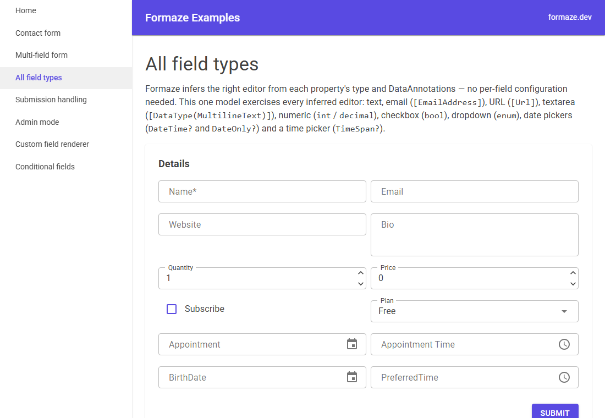
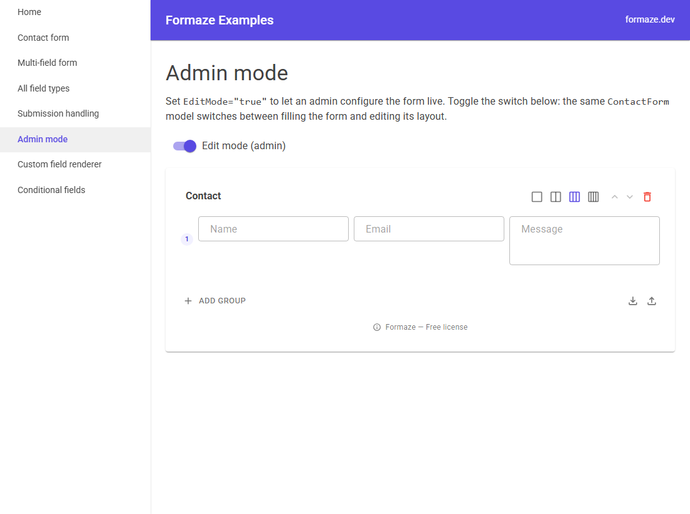

<div align="center">

# Formaze

### Zero form markup. Developers install, admins design.

**Formaze** is a no-code form builder for **Blazor** (built on MudBlazor). Drop one component in, point it at a plain C# class, and your team gets a fully-rendered, validated form — that non-developers can then reshape live in the browser, no redeploy required.

[](https://www.nuget.org/packages/Formaze.Blazor.MudBlazor)
[](https://www.nuget.org/packages/Formaze.Blazor.MudBlazor)
[](https://dotnet.microsoft.com/)
[](https://mudblazor.com/)
[](#accessibility)
[](LICENSE)

[**Live demo**](https://formaze.dev/demo) · [**Get a license**](https://formaze.dev/checkout) · [**NuGet**](https://www.nuget.org/packages/Formaze.Blazor.MudBlazor) · [**formaze.dev**](https://formaze.dev)


</div>

> **About this repository:** this is the public examples, documentation and issue tracker for Formaze. The `Formaze.Blazor.MudBlazor` package itself is a **commercial, closed-source** product. The example projects in *this* repo are MIT-licensed — see [LICENSE](LICENSE) for the exact scope.

---

## Why Formaze

- **No form markup to write.** You write a C# class with DataAnnotations; Formaze renders the inputs, labels, layout and validation for you.
- **Admins own the form, not developers.** Flip `EditMode="true"` and a non-technical user can reorder fields, group them, switch column layouts and import/export the definition (Pro) — live, in the browser.
- **Built on MudBlazor.** Forms inherit your MudBlazor theme and look native to your app out of the box.
- **Bring your own storage.** JSON files, in-memory, EF Core, or a store you write yourself.
- **Accessible by default.** Keyboard-navigable, screen-reader friendly, [WCAG 2.2 AA](#accessibility).

## See it in action

**One model → a complete, validated form.** Every input below is inferred from property types and DataAnnotations — there is no per-field configuration:



**Admins reshape it live.** Set `EditMode="true"` and the same component becomes an editor — groups, column layouts, field ordering, import/export (Pro):



## How it works

1. **Define a model** — a plain C# class with `[Required]`, `[EmailAddress]`, `[Range]`, etc.
2. **Drop in `<FormazeComponent T="YourModel" />`** — pass a `Key`, a `Model` instance and an `OnValidSubmit` handler.
3. **Hand the keys to your admins** — set `EditMode="true"` for the users who should shape the form. Their changes are saved through your chosen storage backend.

## Install

```sh
dotnet add package Formaze.Blazor.MudBlazor
```

## Quick start

Formaze builds on top of MudBlazor, so register MudBlazor first, then Formaze:

```csharp
// Program.cs
using Formaze.Blazor.Mudblazor.Tools;

builder.Services.AddMudServices();
builder.Services.AddFormazeJson(options =>
{
    options.LicenseKey = "YOUR_LICENSE_KEY"; // omit for the Free tier
});
```

Drop a form into any page by pointing the component at your model (the component lives in
`Formaze.Blazor.Mudblazor.Components` — add it to `_Imports.razor`):

```razor
@using Formaze.Blazor.Mudblazor.Components

<FormazeComponent T="ContactForm"
                  Key="contact"
                  Model="_model"
                  EditMode="_isAdmin"
                  OnValidSubmit="HandleSubmit" />

@code {
    private ContactForm _model = new();
    private bool _isAdmin;

    private Task HandleSubmit(EditContext context)
    {
        // _model is populated and valid here
        return Task.CompletedTask;
    }
}
```

`Key` and `Model` are required. `EditMode="true"` lets an admin configure the form live; `OnValidSubmit` is an `EventCallback<EditContext>`.

## Storage backends

Pick how form definitions are persisted when you register Formaze:

| Method | Use case |
| --- | --- |
| `AddFormazeJson(...)` | JSON files on disk (default) |
| `AddFormazeInMemory(...)` | Prototyping and tests |
| `AddFormaze<TStore>()` | Your own store implementation |
| `AddFormaze(factory)` | Store built from a factory |
| `AddFormazeEfCore<TDbContext>()` | EF Core — needs the `Formaze.Blazor.MudBlazor.EFCore` companion package |

## Supported field types

Field editors are inferred from your model's property types and DataAnnotations:

| Property | Rendered as |
| --- | --- |
| `string` | Text input |
| `string` + `[EmailAddress]` | Email input |
| `string` + `[Url]` | URL input |
| `string` + `[DataType(DataType.MultilineText)]` | Textarea |
| `int` / `long` / `decimal` / `double` / `float` | Numeric input |
| `bool` | Checkbox |
| `DateTime` / `DateOnly` / `DateTimeOffset` | Date picker |
| `TimeSpan` | Time picker |
| `enum` | Dropdown |

Nullable variants of the above are supported as well (use `DateTime?` or `DateOnly?` for an optional date).

## Examples

Most examples live in a single runnable gallery app — `dotnet run` it and browse one page per feature:

```sh
cd samples/Formaze.Examples.Gallery
dotnet run
```

| Sample | Page | Shows |
| --- | --- | --- |
| Contact form | [BasicForm.razor](samples/Formaze.Examples.Gallery/Components/Pages/BasicForm.razor) | `string` / email / textarea fields with DataAnnotations validation |
| Multi-field form | [MultiField.razor](samples/Formaze.Examples.Gallery/Components/Pages/MultiField.razor) | enum, bool, date and numeric fields |
| All field types | [FieldTypes.razor](samples/Formaze.Examples.Gallery/Components/Pages/FieldTypes.razor) | Every inferred editor (text, email, url, textarea, number, checkbox, date, time, enum) in one model |
| Admin mode | [AdminMode.razor](samples/Formaze.Examples.Gallery/Components/Pages/AdminMode.razor) | `EditMode` live form configuration |
| Submission handling | [SubmissionHandling.razor](samples/Formaze.Examples.Gallery/Components/Pages/SubmissionHandling.razor) | Custom `SubmitLabel` and reading the bound model in `OnValidSubmit` |
| Custom field renderer | [CustomRenderer.razor](samples/Formaze.Examples.Gallery/Components/Pages/CustomRenderer.razor) | Overriding the rendering of a field (new in 1.1.0) |
| Conditional fields | [ConditionalFields.razor](samples/Formaze.Examples.Gallery/Components/Pages/ConditionalFields.razor) | Show a field based on another field's value, configured in the editor (new in 1.1.0) |

Storage backends that register a different store live in their own projects:

```sh
cd samples/Formaze.Examples.EfCore     # or Formaze.Examples.CustomStore
dotnet run
```

| Sample | Shows |
| --- | --- |
| [EF Core store](samples/Formaze.Examples.EfCore) | Persisting definitions in SQLite via `AddFormazeEfCore<TDbContext>()` + `modelBuilder.UseFormaze()` |
| [Custom store](samples/Formaze.Examples.CustomStore) | Implementing `IFormazeStore` by hand and registering it with `AddFormaze<TStore>()` |

## Accessibility

Formaze targets **WCAG 2.2 AA**. Generated forms are fully keyboard-navigable, label every input, expose validation messages to assistive technology, and respect the focus order of your model — so the forms your admins build stay accessible without extra work.

## Licensing

Formaze is a commercial product with a **Free tier** to get started. Pick up a license at **[formaze.dev/checkout](https://formaze.dev/checkout)**.

The example code in this repository is MIT-licensed — see [LICENSE](LICENSE).

## Support

Found a bug or have a question about the examples? [Open an issue](https://github.com/alex892-droid/Formaze-Example/issues). For licensing and product questions, see [formaze.dev](https://formaze.dev).
